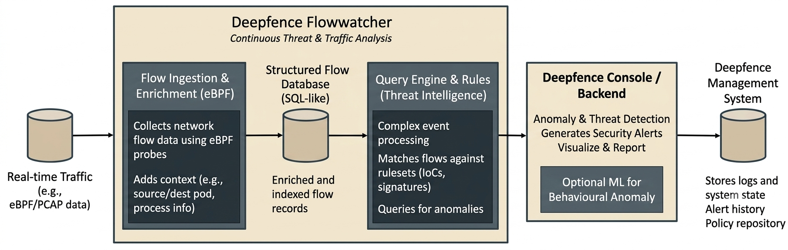
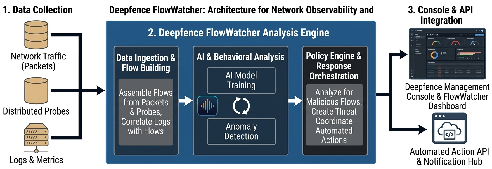

# FlowWatcher

Deepfence Flowwatcher is an experimental utility built for analysing and classifing packets by looking at packet headers.

## Primary design goals:

Deepfence Flowwatcher aims to:

- **Classify packets and flows as benign or malicious with high true positives (TP) and low false positives (FP)**.
- **Use the labeled data to reduce amount of traffic requiring deeper analysis**.

Additionally, Deepfence Flowwatcher also categorizes packets into flows and shows a rich ensemble of flow data and statistics.

| -## Architecture
## Architecture

### 1. System Architecture

### 2. Analysis Engine

| :--------------------------------------------------------------------------------------------------------------------------------------------------: |
|  .

## Who uses Deepfence Flowwatcher?

- We use Deepfence Flowwatcher internally to quickly analyse and label packets. It forms one part of a project to build a fast pre-filter for packets before we conduct deeper layer-7 analysis in [Deepfence ThreatMapper](https://deepfence.io/threatmapper/).

## Get in touch

Thank you for using Deepfence Flowwatcher.

-## Architecture
## Architecture

### 1. System Architecture

### 2. Analysis Engine

### 1. System Architecture

### 2. Analysis Engine Architecture

](https://github.com/srihariniii25/FlowWatcher/issues)
- [productsecurity _at_ deepfence _dot_ io](SECURITY.md): Found a security issue? Share it in confidence
- Find out more at [deepfence.io](https://deepfence.io/)

## Security and Support

For any security-related issues in the Deepfence Flowwatcher project, contact [productsecurity _at_ deepfence _dot_ io](SECURITY.md).

Please file GitHub issues as needed, and join the Deepfence Community [Slack channel](https://join.slack.com/t/deepfence-community/shared_invite/zt-podmzle9-5X~qYx8wMaLt9bGWwkSdgQ).

## License

The Deepfence Flowwatcher project (this repository) is offered under the [Apache2 license](https://www.apache.org/licenses/LICENSE-2.0).

[Contributions](CONTRIBUTING.md) to the Deepfence Flowwatcher project are similarly accepted under the Apache2 license, as per [GitHub's inbound=outbound policy](https://docs.github.com/en/github/site-policy/github-terms-of-service#6-contributions-under-repository-license).

Updated readme file
