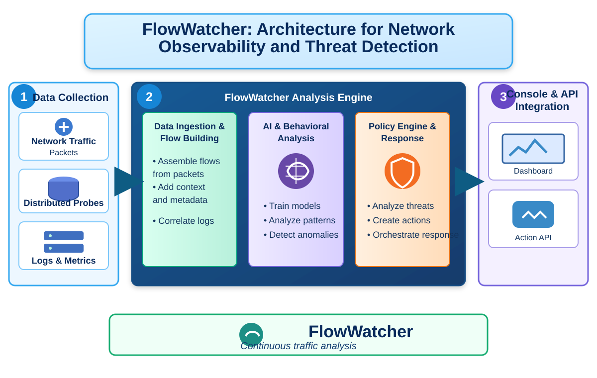

# FlowWatcher

FlowWatcher is an experimental utility built for analysing and classifying packets by looking at packet headers.

## Primary design goals:

FlowWatcher aims to:

- **Classify packets and flows as benign or malicious with high true positives (TP) and low false positives (FP)**.
- **Use the labeled data to reduce amount of traffic requiring deeper analysis**.

Additionally, FlowWatcher categorizes packets into flows and shows a rich ensemble of flow data and statistics.

## Architecture

## When to use FlowWatcher
Use FlowWatcher if you wish to build and operate machine-learning models on network packet data.

## Quick Start

For full instructions, refer to the [project documentation](quickstart.md).

## Security and Support

Please file security reports and support questions through the repository's GitHub issue tracker.

## License

The FlowWatcher project is offered under the [Apache2 license](https://www.apache.org/licenses/LICENSE-2.0).

[Contributions](CONTRIBUTING.md) to the FlowWatcher project are similarly accepted under the Apache2 license, as per [GitHub's inbound=outbound policy](https://docs.github.com/en/github/site-policy/github-terms-of-service#6-contributions-under-repository-license).
